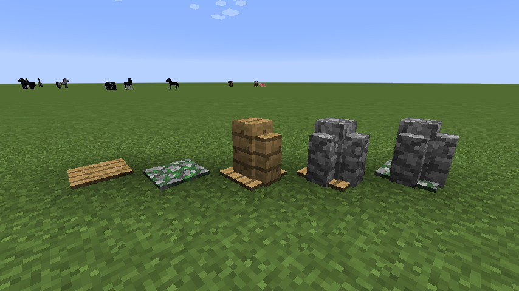

Forge的方块状态
=============

Forge有它自己的方块状态json格式来迎合mod开发者的需求。它引入了子模型(Submodel)，子模型允许你能通过不同的部件构建最终的方块状态。你能够由不同的部件构建模型的**标准(normal)**方块状态，也能够根据方块的属性创建一个非常复杂的变种(variant)。


!!! Attention

	注意所有引用的模型和材质都是原版Minecraft里的。对于你自己的mod.你需要使用完整的路径！
	例如: "mymod:blocks/blockTexture"。

	你并不一定需要使用Forge的方块状态格式，你也可以使用原版的格式！

格式的总体结构
------------

```json
{
	"forge_marker": 1,
	"defaults": {
		"textures": {
			"all": "blocks/dirt"
		},
		"model": "cube_all",
		"uvlock": true
	},
	"variants": {
		"normal": [{

		}]
	}
}
```

这个json声明了一个简单的方块状态: 每一面都是泥土的材质。我们来仔细看看这个文件。

```json
	"forge_marker": 1,
```

这个语句告诉游戏这个方块状态的json是Forge里的，而不是原版Minecraft的.
这里面的"1"是格式的版本，从而保证有一天格式改变后旧版本的方块状态json仍然可以被支持。目前只有这一个版本。

```json
	"defaults": {
		"textures": {
			"all": "blocks/dirt"
		},
		"model": "cube_all",
		"uvlock": true
	}
```

这里的 `defaults` 部分包含所有变种的默认值。这些值可以被变种的值覆盖。`defaults`部分是**可选的**！你并不需要定义`defaults`，所以这一整块可以完全被省略。

```json
	"variants": {
		"normal": [{

		}]
	}
```
这里定义了方块的所有变种。这个简单的泥土方块只有默认的**标准(normal)**变种。这个例子中它没有包含更多的信息。所有在 `defaults` 里定义的东西都可以放在这里。

例如:
```json
	"normal": [{
		"textures": {
			"side": "blocks/cobblestone",
			"end": "blocks/dirt"
		},
		"model": "cube_column"
	}]
```

这个标准变种将会使用 `cube_column` 模型，使得圆石的材质在侧面，泥土的材质在顶部和底部。

子模型(Sub-Models)
-----------------

为了展示子模型的使用，我们会创建一个有不同变种模型。每一个变种会使用子模型来创建一个不同的模型。
这个模型将会是一个压力板，根据状态的不同它将会加上不同的部件。

```json
{
	"forge_marker": 1,
	"defaults": {
		"textures": {
			"texture": "blocks/planks_oak",
			"wall": "blocks/planks_oak"
		},
		"model": "pressure_plate_up",
		"uvlock": true
	},
	"variants": {
		// mossy是一个boolean值
		"mossy": {
			"true": {
				// 如果为true他将会把压力板材质从橡木木板改为苔石
				"textures": {
					"texture": "blocks/cobblestone_mossy"
				}
			},
			"false": {
				// 什么都不改变。为了Minecraft的内部使用，这个条目必须要加上
			}
		},
		// pillarcount是一个判断我们有多少立柱的子模型的一个属性。范围是0-2
		"pillarcount": {
			0: {
				// 没有立柱。记住，这一条目必须要在这里
			},
			1: {
				// 如果这一条为true, 它将会添加墙的模型，并且和压力板的模型合并起来
				"submodel": "wall_n"
			},
			2: {
				"textures": {
					"wall": "blocks/cobblestone"
				},
				"submodel": {
					"pillar1": { "model": "wall_n" },
					"pillar2": { "model": "wall_n", "y": 90 }
				}
			}
		}
	}
}
```

这个json里面的注释已经很清楚解释了每一部分的细节，但是这里是它总体怎么工作的: 代码中方块的定义有两个属性。一个是叫做"mossy"的boolean属性，另一个是叫做"pillarCount"的integer属性。但是注意json中的字符串是**小写**的(译注:注意pillarCount这一属性)。它必须是小写的否则将会无法找到。

我们没有定义说"这个属性的组合对应了模型X"，相反，我们说"这个属性的值**影响**了这个模型"。在这个例子当中它是非常明确的:

- 如果mossy为true，压力板使用苔石的材质
- 如果pillarCount值为1，它将会加上一个向北连接的墙。墙的默认材质是橡木木板
- 如果pillarCount值为2，它将会加上两个墙，都向北连接。但是第二个墙会旋转90度。这展示了你并不需要为其创建另外的Forge系统模型。你只需要一个模型并且将其绕Y轴旋转。另外，墙的材质换成了圆石
- 如果pillarCount值为0，没有墙会被加上

这是我们工作的结果:


