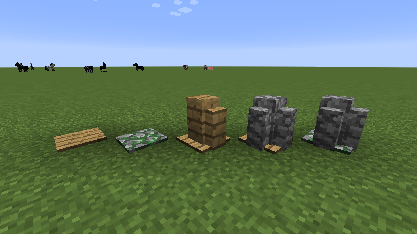

Forge的方块状态
===================

为适应mod开发者的需要，Forge有自己的方块状态JSON格式。它包括子模型，可以让你从不同的部分构建最终的方块状态。

!!! Attention "注意"

    注意，所有的模型和材质都指的是原版`minecraft`的，要用你自己mod的，必须要用完整的路径!如`"mymod:blocks/blockTexture"`
    
    你不必使用Forge的方块状态格式，可以使用原版的格式！

普通格式结构
-------------------------------

```json
{
  "forge_marker": 1,
  "defaults": {
    "textures": {
      "all": "blocks/dirt"
    },
    "model": "cube_all",
    "uvlock": true
  },
  "variants": {
    "normal": [{}]
  }
}
```

这个json描述了一个每个面都是泥土的简单方块状态。让我们一点一点来看:

```json
  "forge_marker": 1,
```

它告诉游戏方块状态json是来自于Forge，而不是原版Minecraft。1是格式的版本，以确保老版本的在更新后也支持。目前只有这一个版本。

```json
  "defaults": {
    "textures": {
      "all": "blocks/dirt"
    },
    "model": "cube_all",
    "uvlock": true
  }
```

defaults部分包含默认值变体。它们会被变体覆盖。这一部分是__可选__的你不必定义默认值，方块可以完全被省略。

```json
  "variants": {
    "normal": [{}]
  }
```

这定义了方块的变体。简单的泥土块只有默认和_normal_变体。这种情况下，它不包含任何附加信息。在默认值里定义的所有东西也可以在这定义。例如:

```json
  "normal": [{
    "textures": {
      "side": "blocks/cobblestone",
      "end": "blocks/dirt"
    },
    "model": "cube_column"
  }]
```

normal变体用_立方住_模型，四周是圆石顶部和底部是泥土。

`variants`部分中每个条目要么定义一个[方块状态][blockstate]属性，要么定义一个变体。属性以这种形式定义:

```json
    "variants": {
      "property_name": {
        "value0": {},
        "value1": {},
        "__comment": "Etc."
      }
   }
```

给定的方块状态可以有任意数量的属性。当方块状态被加载时，属性的值用于创建方块所有可能的变体。上面的例子会创建2个变体，`property_name=value0` 和`property_name=value1`。如果有两个属性，它会创建变体 `prop1=value11,prop2=value21`, `prop1=value12,prop2=value21`, `prop1=value11,prop2=value22`等(以字母表顺序排序)。每个这样的变体进入它的所有变体的集合。例如:

```json
{
  "forge_marker": 1,
  "variants": {
    "shiny": {
      "true":  { "textures": { "all": "some:shiny_texture" } },
      "false": { "textures": { "all": "some:flat_texture"  } }
    },
    "broken": {
      "true":  { "model": "some:broken_model" },
      "false": { "model": "some:intact_model" }
    }
 }
}
```

变体 `broken=false,shiny=true` 从`variants.broken.true.model`采用`some:intact_model` ，从 `variants.shiny.true.textures`采用 `some:shiny_texture` 。

条目也可以是普通的变体

```json
    "variants": {
      "normal": { "model": "some:model" }
    }
```

这种方式的定义直接定义"normal"变体，不与那些列出来的键值形成组合。它仍然继承自“defaults”方块（如果存在），并且如果属性的变体生成具有相同名称的变体，则直接定义的变量覆盖原有的值。如果变体定义成一个列表,那么每个元素都是变体的定义,那么会随机使用一个:

```json
    "defaults": { "model": "some:model" }
    "variants": {
      "__comment": "当被使用时,模型有75%的可能性会被旋转.",
      "normal": [{ "y": 0 }, { "y": 90 }, { "y": 180 }, { "y": 270 }]
    }
```

通过第一个条目的类型消除直接变体和属性定义的歧义。 如果`variants.<something>`的第一个条目是一个对象，那么它是一个属性定义。 如果它是其他的东西，它是一个直的变体。 为了避免混淆，建议使用一个元素将直接变体包装在列表中：

```json
   "variants": {
     "simple": [{
       "custom": {},
       "model": "some:model",
       "__comment": "没有列表的话，定义的{}会使Forge认为这是一个属性定义。"
     }]
   }
```

子模型
----------

为了展示子模型的使用，我们将创建一个具有不同变体的模型。 每个变体都将使用子模型来创建不同的模型。

该模型将是一个压力板，根据其状态，它将添加不同部件。

```json
{
  "forge_marker": 1,
  "defaults": {
    "textures": {
      "texture": "blocks/planks_oak",
      "wall": "blocks/planks_oak"
    },
    "model": "pressure_plate_up",
    "uvlock": true
  },
  "variants": {
    "__comment": "mossy是一个布尔值.",
    "mossy": {
      "true": {
        "__comment": "如果为true，它会将压力板从橡木板改为苔石。",
        "textures": {
          "texture": "blocks/cobblestone_mossy"
        }
      },
      "false": {
        "__comment": "什么也没变.这一条必须在,这样Forge方块状态加载器才会生成这种变体."
      }
    },
    "__comment": "pillarcount 决定模型有多少柱子. 从0到2.",
    "pillarcount": {
      "0": {
        "__comment": "没有柱子.记住,空的定义必须要在."
      },
      "1": {
        "__comment": "它将添加墙模型并将其与压力板结合.",
        "submodel": "wall_n"
      },
      "2": {
        "textures": {
          "wall": "blocks/cobblestone"
        },
        "submodel": {
          "pillar1": { "model": "wall_n" },
          "pillar2": { "model": "wall_n", "y": 90 }
        }
      }
    }
  }
}
```

这些注释已经解释了各个部分的细节，但是这里的整体工作原理如下：代码中的块定义有两个属性。 一个名为`mossy`的布尔属性和一个名为`pillarCount`的整数属性。

!!! note "提示"

    注意这里json里的字符串是用**小写**的.它必须是小写的,不然它就找不到.

我们不是定义“这种属性的组合给出模型X”，而是说“**这个属性的**值对模型有什么影响”。 在这个例子中很容易看出来：

* 如果`mossy`为真,压力板会用苔石材质.
* 如果`pillarCount`为`1`,它会加上朝北的墙.墙的默认材质是橡木板.
* 如果`pillarCount`是`2`，它将增加两面墙，两面都朝北。 然而，第二个墙将旋转90度。 这表明您不需要与Forge系统分开的模型。 您只需要一次并绕Y轴的旋转。 此外，墙壁的纹理改为鹅卵石.
* 如果`pillarCount`是`0`,不会增加墙.

这是结果:



[blockstate]: ../../blocks/states.md
